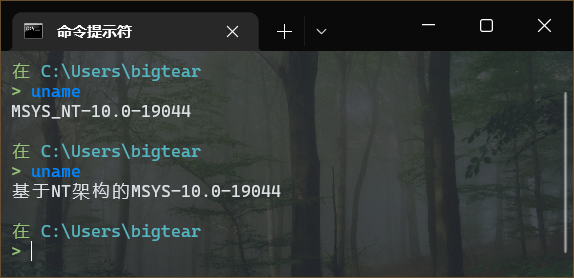
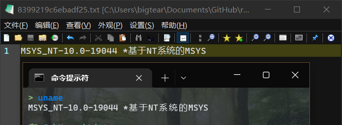

# reprint

# Work with all PowerShell

---

## 尚未完成
## 和Window结合的用法等待v1.0.0时完善

## Not yet completed
## The usage combined with window will be improved in v1.0.0

---

## 终端输出替换工具

支持 Win/Linux/macOS

---

🏠 [主页](https://github.com/BigTear/reprint) 📚 [文档](https://github.com/BigTear/reprint)

---

### 用途

- 给不支持输出中文的软件添加翻译并无缝使用（我开发这个程序的目的）
- 给终端添加无障碍支持
- 更友好的输出内容

---

### 使用截图
主要是用来翻译和美化终端输出，这里举个不恰当的例子

上面是原uname的输出，下面是自定义的uname输出

自定义的内容和输出

---

### 源码说明

| 项目       | 说明   |  备注 |
|----------|------|-----|
| `r`      | 主程序  | bin |
| `common` | 共享库  | lib |
| `cook`   | 翻译工具 | bin |

### TODO

- Font Color 字符颜色支持
- Trans Tool 翻译工具